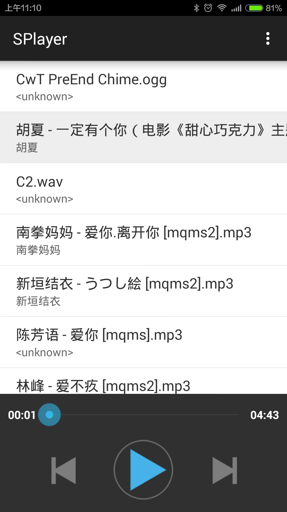

#SPlayer

A simple andorid music player demo code.

This code show you how to use `ContentResolver` to get the music list and use `MediaPlayer` to play songs.

#Fetures
1. Get the music list
2. Play and pause
3. Play next or play previous

#Screenshot
